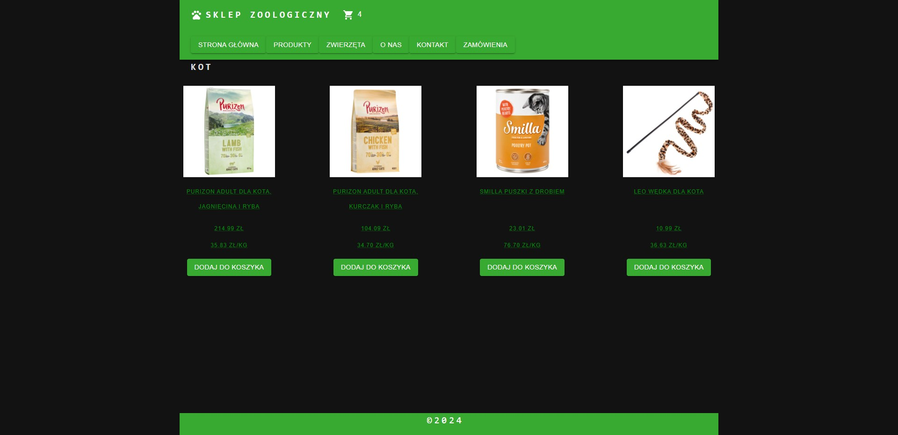

# TIN
Projekt końcowy z przedmiotu Technologie Internetu

## Technologie
* Node.js
* React
* MySQL

## Instrukcja uruchomienia projektu

### Rozpakownaie archiwum z kodem źródłowym

### Informacje o załączonych plikach dotyczących bazy danych
1. `final_proj_tin_db.sql` - plik inicjalizujący bazę danych 
2. `final_proj_tin_sample_data.sql` - plik z przykładowymi danymi do bazy danych

### Uruchomienie serwera MySQL
1. Przejść do katalogu głównego `final_project_tin_s22086` z kodem źródłowym
2. Otworzyć plik `compose.yml`
3. Uruchomić skrypt bazy danych (`docker-compose up`)

### Uruchomienie backendu
1. Przejść do katalogu głównego `final_project_tin_s22086/package.json`
2. W tym folderze należy zainstalować wszystkie zależności skryptem `npm install`
3. **Włączyć skrypt `start` (zwykły tryb)** lub `start-dev` (tryb deweloperski)

### Uruchomienie frontendu
1. Przejść do `final_project_tin_s22086/public/package.json`
2. W tym folderze należy zainstalować wszystkie zależności skryptem `npm install`
3. Zbudować projekt skryptem `build`
4. Włączyć projekt skryptem `start`

## Diagram schematu bazy danych

## Opis projektu i funkcjonalności
Projekt realizuje witrynę internetowego sklepu zoologicznego.
Użytkownik może bez potrzeby logowania, ale z wykorzytaniem adresu email, dodać produkty do koszyka, a następnie złożyć zamówienie.

Dodawanie, aktualizacja, usuwanie rekordów do bazy danych realizowane jest w sekcji komentarzy do produktu. Jak również wyświetlanie widoków szczegółowych kokretnych produktów.

Wyświetlanie listy wszystkich rekordów dla każdej tabeli realizowane jest na stronie głównej (zakładka `STRONA GŁÓWNA`)

Produkty skatalogowane są w dwóch sekcjach zlokalizowanych w palenlu głównym:

1. `PRODUKTY` 
   * `SMACZKI` 
   * `KARMA`
   * `ZABAWKI`

2. `ZWIERZĘTA` 
   * `PIES`
   * `KOT`
   
  
   
   
Widoki poszczególnych kategorii produktów:

`KARMA`

`SMACZKI`

`ZABAWKI`

Widoki poszczególnych kategorii zwierząt:

`PIES`

`KOT`

Ponaciśnięciu przycisku z koszykiem, można przejśćdo widoku koszyka. Ikonka pojawią się tylko wtedy, gdy w koszyku znajdują się produkty. Cyfra obok ikonki oznacza ilość produktów w koszyku.

Widok koszyka z zamówieniem:

Podsumowanie zamówienia:

Widok wszystkich zamówień:

Widok szczegółowy konkretnego zamówienia (dostępny po klinięciu w przycisk z konkretnym `ID ZAMÓWIENIA`):

Widok sekcji `O NAS`:

Widok sekcji `KONTAKT`:

